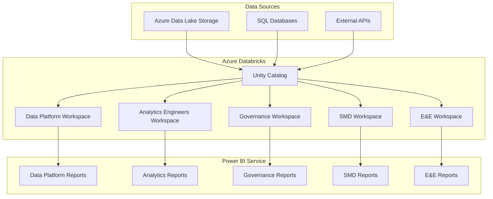

# Power BI Self-Service Assessment: Unity Catalog Governance Design

## 🎯 **Executive Summary**

This document outlines the comprehensive design for implementing self-service Power BI across multiple departments using Unity Catalog governance. The solution addresses data access control, workspace organization, and scalable governance while ensuring security and maintainability.

## 📋 **Business Requirements**

### **Target Departments:**
- **Data Platform Team**: Core data infrastructure and governance
- **Analytics Engineers**: Data modeling and transformation
- **Data Governance**: Compliance and data quality oversight
- **SMD (Ship Management Department)**: Operational analytics
- **E&E (Engineering & Estimating)**: Project and cost analytics

### **Key Objectives:**
- Enable self-service analytics across all departments
- Maintain strict data governance and security
- Ensure scalable and maintainable architecture
- Provide role-based access control
- Integrate with existing Power BI infrastructure

## 🏗️ **Architecture Design**

### **High-Level Architecture**



## 🗂️ **Workspace Organization**

### **1. Data Platform Team Workspace**
- **Purpose**: Core data infrastructure and governance
- **Access**: Full administrative access
- **Resources**:
  - SQL Warehouses: `platform-warehouse` (Large, always-on)
  - Catalogs: `platform_catalog` (all data)
  - Schemas: `raw`, `curated`, `analytics`
- **Power BI Integration**: 
  - Premium capacity
  - Direct query to curated schemas
  - Scheduled refresh for aggregated tables

### **2. Analytics Engineers Workspace**
- **Purpose**: Data modeling and transformation
- **Access**: Read/write to curated schemas
- **Resources**:
  - SQL Warehouses: `analytics-warehouse` (Medium, auto-stop)
  - Catalogs: `analytics_catalog`
  - Schemas: `models`, `staging`, `marts`
- **Power BI Integration**:
  - Premium capacity
  - Direct query to data marts
  - Incremental refresh capabilities

### **3. Data Governance Workspace**
- **Purpose**: Compliance and quality oversight
- **Access**: Read-only access to all data
- **Resources**:
  - SQL Warehouses: `governance-warehouse` (Small, on-demand)
  - Catalogs: `governance_catalog`
  - Schemas: `quality`, `lineage`, `compliance`
- **Power BI Integration**:
  - Premium capacity
  - Governance dashboards
  - Quality monitoring reports

### **4. SMD (Ship Management Department) Workspace**
- **Purpose**: Operational ship management analytics
- **Access**: Read access to operational data
- **Resources**:
  - SQL Warehouses: `smd-warehouse` (Medium, auto-stop)
  - Catalogs: `smd_catalog`
  - Schemas: `operations`, `fleet`, `maintenance`
- **Power BI Integration**:
  - Premium capacity
  - Operational dashboards
  - Real-time fleet monitoring

### **5. E&E (Engineering & Estimating) Workspace**
- **Purpose**: Project and cost analytics
- **Access**: Read access to project and financial data
- **Resources**:
  - SQL Warehouses: `ee-warehouse` (Medium, auto-stop)
  - Catalogs: `ee_catalog`
  - Schemas: `projects`, `estimates`, `costs`
- **Power BI Integration**:
  - Premium capacity
  - Project dashboards
  - Cost analysis reports

## 🔐 **Security and Access Control**

### **Unity Catalog Security Model**

```sql
-- Data Platform Team (Full Access)
GRANT ALL PRIVILEGES ON CATALOG platform_catalog TO `data_platform_team`;
GRANT ALL PRIVILEGES ON SCHEMA platform_catalog.raw TO `data_platform_team`;
GRANT ALL PRIVILEGES ON SCHEMA platform_catalog.curated TO `data_platform_team`;

-- Analytics Engineers (Modeling Access)
GRANT USE CATALOG analytics_catalog TO `analytics_engineers`;
GRANT ALL PRIVILEGES ON SCHEMA analytics_catalog.models TO `analytics_engineers`;
GRANT SELECT ON SCHEMA platform_catalog.curated TO `analytics_engineers`;

-- Data Governance (Read-Only Access)
GRANT USE CATALOG governance_catalog TO `data_governance`;
GRANT SELECT ON ALL SCHEMAS IN CATALOG platform_catalog TO `data_governance`;
GRANT SELECT ON ALL SCHEMAS IN CATALOG analytics_catalog TO `data_governance`;

-- SMD (Operational Access)
GRANT USE CATALOG smd_catalog TO `smd_team`;
GRANT SELECT ON SCHEMA smd_catalog.operations TO `smd_team`;
GRANT SELECT ON SCHEMA platform_catalog.curated TO `smd_team`;

-- E&E (Project Access)
GRANT USE CATALOG ee_catalog TO `ee_team`;
GRANT SELECT ON SCHEMA ee_catalog.projects TO `ee_team`;
GRANT SELECT ON SCHEMA platform_catalog.curated TO `ee_team`;
```

### **Power BI Security Integration**

#### **Row-Level Security (RLS)**
```sql
-- SMD Row-Level Security
CREATE POLICY smd_fleet_access ON smd_catalog.operations.fleet_data
AS PERMISSIVE FOR SELECT
TO `smd_team`
USING (ship_owner = CURRENT_USER() OR department = 'SMD');

-- E&E Row-Level Security
CREATE POLICY ee_project_access ON ee_catalog.projects.project_data
AS PERMISSIVE FOR SELECT
TO `ee_team`
USING (project_manager = CURRENT_USER() OR department = 'E&E');
```

#### **Power BI Dataset Security**
- **Data Platform**: Full access to all datasets
- **Analytics Engineers**: Access to modeling datasets
- **Governance**: Read-only access to monitoring datasets
- **SMD**: Access to operational datasets with RLS
- **E&E**: Access to project datasets with RLS

## 📊 **Power BI Integration Architecture**

### **Connection Patterns**

#### **1. Direct Query (Recommended)**
```python
# Power BI Direct Query Configuration
connection_string = f"""
Server={databricks_host};
HTTPPath=/sql/1.0/warehouses/{warehouse_id};
UID=token;
PWD={personal_access_token};
Database={catalog_name};
Schema={schema_name};
"""
```

**Benefits:**
- Real-time data access
- Always up-to-date information
- No data duplication
- Automatic query optimization

#### **2. Import Mode (For Aggregated Data)**
```sql
-- Create aggregated tables for Power BI import
CREATE TABLE analytics_catalog.models.sales_summary AS
SELECT 
    region,
    product_category,
    SUM(sales_amount) as total_sales,
    COUNT(DISTINCT customer_id) as unique_customers,
    DATE_TRUNC('month', order_date) as month
FROM platform_catalog.curated.sales_data
GROUP BY region, product_category, DATE_TRUNC('month', order_date);
```

**Benefits:**
- Faster report performance
- Reduced warehouse load
- Offline capability
- Complex calculations

### **Refresh Strategies**

#### **Incremental Refresh**
```sql
-- Configure incremental refresh for large tables
ALTER TABLE analytics_catalog.models.sales_summary
SET TBLPROPERTIES (
    'delta.autoOptimize.optimizeWrite' = 'true',
    'delta.autoOptimize.autoCompact' = 'true'
);

-- Partition by date for incremental refresh
PARTITION BY DATE_TRUNC('month', order_date)
```

#### **Scheduled Refresh**
- **Data Platform**: Continuous refresh (every 15 minutes)
- **Analytics Engineers**: Hourly refresh for models
- **Governance**: Daily refresh for monitoring data
- **SMD**: Real-time refresh for operational data
- **E&E**: Daily refresh for project data

## 🚀 **Scalability Design**

### **SQL Warehouse Sizing Strategy**

| Workspace | Warehouse Size | Auto-Stop | Max Clusters | Purpose |
|-----------|----------------|-----------|--------------|---------|
| Data Platform | 2X-Large | Never | 1 | Core infrastructure |
| Analytics Engineers | Large | 10 min | 2 | Data modeling |
| Governance | Small | 15 min | 1 | Monitoring |
| SMD | Large | 10 min | 3 | Operational analytics |
| E&E | Medium | 15 min | 2 | Project analytics |

### **Auto-Scaling Configuration**
```python
# Auto-scaling configuration for each warehouse
warehouse_config = {
    "min_num_clusters": 1,
    "max_num_clusters": 3,
    "auto_stop_mins": 10,
    "enable_photon": True,
    "enable_serverless_compute": True
}
```

### **Data Partitioning Strategy**
```sql
-- Partition large tables for better performance
CREATE TABLE platform_catalog.curated.sales_data
USING DELTA
PARTITIONED BY (year, month)
AS SELECT * FROM raw.sales_data;

-- Z-order for better query performance
OPTIMIZE platform_catalog.curated.sales_data
ZORDER BY (customer_id, product_id);
```

## 🔧 **Maintainability Framework**

### **Infrastructure as Code**
```hcl
# Terraform configuration for workspace management
resource "databricks_sql_endpoint" "smd_warehouse" {
  name             = "smd-warehouse"
  cluster_size     = "Large"
  auto_stop_mins   = 10
  max_num_clusters = 3
  
  tags = {
    Department = "SMD"
    Environment = "Production"
    ManagedBy = "Terraform"
  }
}

resource "databricks_catalog" "smd_catalog" {
  name    = "smd_catalog"
  comment = "SMD operational data catalog"
}

resource "databricks_schema" "smd_operations" {
  catalog_name = databricks_catalog.smd_catalog.name
  name         = "operations"
  comment      = "SMD operations schema"
}
```

### **Monitoring and Alerting**
```python
# Monitoring configuration
monitoring_config = {
    "warehouse_utilization": {
        "threshold": 80,
        "alert_email": "platform-team@company.com"
    },
    "query_performance": {
        "slow_query_threshold": 300,  # seconds
        "alert_slack": "#databricks-alerts"
    },
    "data_freshness": {
        "max_lag_minutes": 60,
        "alert_pagerduty": "databricks-oncall"
    }
}
```

### **Automated Testing**
```python
# Data quality tests
def test_data_quality():
    # Test data completeness
    assert df.filter(col("customer_id").isNull()).count() == 0
    
    # Test data freshness
    latest_date = df.select(max("order_date")).collect()[0][0]
    assert (datetime.now() - latest_date).days <= 1
    
    # Test data consistency
    assert df.select(countDistinct("region")).collect()[0][0] >= 5
```

## ⚠️ **Risk Assessment and Mitigation**

### **Security Risks**

| Risk | Impact | Probability | Mitigation |
|------|--------|-------------|------------|
| Unauthorized data access | High | Low | Row-level security, audit logging |
| Data leakage | High | Medium | Network isolation, encryption |
| Privilege escalation | Medium | Low | Principle of least privilege |
| Insider threats | High | Low | Access monitoring, separation of duties |

### **Performance Risks**

| Risk | Impact | Probability | Mitigation |
|------|--------|-------------|------------|
| Warehouse overload | Medium | Medium | Auto-scaling, query optimization |
| Slow report performance | Medium | High | Caching, materialized views |
| Resource contention | Low | Medium | Resource isolation, scheduling |

### **Operational Risks**

| Risk | Impact | Probability | Mitigation |
|------|--------|-------------|------------|
| Data pipeline failures | High | Medium | Monitoring, automated recovery |
| Schema changes | Medium | High | Version control, testing |
| User training gaps | Low | High | Documentation, training programs |

## 📈 **Implementation Roadmap**

### **Phase 1: Foundation (Weeks 1-4)**
- [ ] Set up Unity Catalog infrastructure
- [ ] Create workspace structure
- [ ] Implement basic security model
- [ ] Deploy Data Platform workspace

### **Phase 2: Core Workspaces (Weeks 5-8)**
- [ ] Deploy Analytics Engineers workspace
- [ ] Deploy Governance workspace
- [ ] Implement data quality framework
- [ ] Set up monitoring and alerting

### **Phase 3: Department Workspaces (Weeks 9-12)**
- [ ] Deploy SMD workspace
- [ ] Deploy E&E workspace
- [ ] Implement row-level security
- [ ] Configure Power BI connections

### **Phase 4: Optimization (Weeks 13-16)**
- [ ] Performance tuning
- [ ] User training
- [ ] Documentation completion
- [ ] Go-live preparation

## 💰 **Cost Optimization**

### **Warehouse Cost Management**
```python
# Cost optimization strategy
cost_optimization = {
    "auto_stop": {
        "data_platform": False,  # Always-on for critical operations
        "analytics": True,       # Auto-stop after 10 minutes
        "governance": True,      # Auto-stop after 15 minutes
        "smd": True,            # Auto-stop after 10 minutes
        "ee": True              # Auto-stop after 15 minutes
    },
    "sizing": {
        "start_small": True,     # Start with smaller warehouses
        "scale_up": True,        # Scale up based on usage
        "monitor_usage": True    # Continuous monitoring
    }
}
```

### **Storage Cost Optimization**
- **Data Lifecycle Management**: Automatic archiving of old data
- **Compression**: Delta Lake automatic compression
- **Partitioning**: Efficient data organization
- **Vacuum**: Regular cleanup of old files

## 📚 **Training and Documentation**

### **User Training Program**
1. **Data Platform Team**: Advanced Unity Catalog administration
2. **Analytics Engineers**: Data modeling and Power BI integration
3. **Governance Team**: Monitoring and compliance reporting
4. **SMD Team**: Operational reporting and dashboard creation
5. **E&E Team**: Project analytics and cost reporting

### **Documentation Structure**
- **Administrator Guide**: Unity Catalog setup and management
- **User Guide**: Power BI connection and report creation
- **Security Guide**: Access control and data governance
- **Troubleshooting Guide**: Common issues and solutions
- **Best Practices**: Performance optimization and cost management

## 🎯 **Success Metrics**

### **Technical Metrics**
- **Query Performance**: < 30 seconds for 95% of queries
- **Data Freshness**: < 1 hour lag for operational data
- **System Availability**: 99.9% uptime
- **User Adoption**: 80% of target users active within 3 months

### **Business Metrics**
- **Report Creation Time**: 50% reduction in time to create reports
- **Data Access**: 100% of required data accessible through self-service
- **Compliance**: 100% audit trail for data access
- **Cost Efficiency**: 30% reduction in data access costs

## 🔄 **Continuous Improvement**

### **Regular Reviews**
- **Monthly**: Performance and cost reviews
- **Quarterly**: Security and compliance audits
- **Annually**: Architecture and strategy reviews

### **Feedback Mechanisms**
- **User Surveys**: Quarterly user satisfaction surveys
- **Support Tickets**: Analysis of common issues
- **Usage Analytics**: Power BI and Databricks usage patterns
- **Performance Metrics**: Continuous monitoring and optimization

---

## 📋 **Conclusion**

This comprehensive design provides a scalable, secure, and maintainable framework for implementing self-service Power BI across multiple departments using Unity Catalog governance. The solution addresses all key requirements while providing a clear path for implementation and ongoing optimization.

The architecture ensures:
- ✅ **Security**: Comprehensive access control and audit trails
- ✅ **Scalability**: Auto-scaling and performance optimization
- ✅ **Maintainability**: Infrastructure as code and monitoring
- ✅ **Cost Efficiency**: Optimized resource utilization
- ✅ **User Experience**: Self-service capabilities with governance

This design serves as the foundation for a successful Power BI self-service implementation that meets both technical and business requirements.
